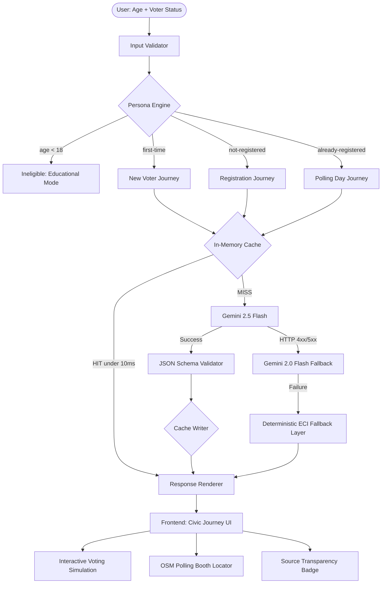

# 🇮🇳 VoteYatra – AI-Powered Guided Voting Assistant

[](https://deepmind.google/technologies/gemini/)
[](https://voteyatra-backend-659148944482.asia-south1.run.app)
[](https://nodejs.org/)
[](https://www.docker.com/)
[](https://voteyatra-backend-659148944482.asia-south1.run.app)
[](./LICENSE)

> **Empowering 970 million eligible voters** through AI-personalized, ECI-compliant guidance — built on Google Gemini 2.5 Flash.

---

## 📌 The Problem

India's election process is one of the most complex in the world. Yet millions of first-time voters, unregistered citizens, and rural participants face the same barrier: **they don't know where to start.**

Static government portals overwhelm users with legal jargon. Generic chatbots hallucinate incorrect processes. The result: voter drop-off, misinformation, and disenfranchisement — especially among 18–25 year-olds.

---

## 🗣️ The Story

Most people don't avoid voting because they don't care.

**They avoid it because the process feels confusing.**

So I built VoteYatra — an AI-powered system that turns India's voting process into a clear, step-by-step journey.

Not a chatbot. Not a wall of text.

**A structured flow.**

🔹 **What makes it different:**
- Persona-aware logic — first-time, returning, or not-yet-registered
- Gemini-powered guidance with strict validation (no random outputs)
- 3-layer reliability system: AI → Cache → ECI fallback
- Source transparency — you always know where the information comes from
- Interactive voting simulation — you actually *experience* casting a vote

**One key decision that changed everything:**

> 👉 AI does NOT control logic — it only enhances it.

That single constraint solved most hallucination problems. Gemini generates the content. The persona engine controls the structure. The validator enforces the rules. Each layer has exactly one job.

---

## 💡 The Solution

**VoteYatra** transforms the voting process into a **4-step, personalized guided journey** — tailored to each citizen's exact age and voter status. Powered by **Gemini 2.5 Flash**, it doesn't just generate text: it classifies users, constrains the AI with persona-specific logic, validates every response, and always falls back to ECI-verified content — never hallucinated steps.

---

## 🏗️ System Architecture

VoteYatra is built for **Reliability, Speed, and Accuracy**.



---

## 🌟 Technical Excellence & Innovation

### 1. 🧠 Status-Aware Prompt Engineering (Hallucination Prevention)

Most LLM civic tools fail because they allow freeform generation. VoteYatra uses **constrained, persona-specific prompting** — the single most important engineering decision in this project.

Each prompt injects **hard logical rules** before Gemini is called:

```
NOT-REGISTERED → Step 1 MUST be Form 6 registration. Never skip.
FIRST-TIME     → NEVER suggest Form 6. User IS registered. Focus on booth experience.
REGISTERED     → Focus on verification and polling day readiness only.
```

This makes it structurally impossible for the model to generate a logically incorrect journey.

---

### 2. 🔁 Resilient Dual-Model Failover

```
Request → gemini-2.5-flash → [FAIL?] → gemini-2.0-flash → [FAIL?] → ECI Static Fallback
```

- **Zero user-facing errors**: The application degrades gracefully through 3 layers
- **Source transparency**: The frontend always shows which layer served the response — `gemini`, `cache`, or `eci`
- **Full logging**: Each failure is captured with model name, HTTP status, and raw response

---

### 3. ⚡ Intelligent Response Caching

```js
// O(1) Map cache — keyed by [age]-[voterStatus]
const cacheKey = `${age}-${voterStatus}`;
if (responseCache.has(cacheKey)) {
    return { steps: responseCache.get(cacheKey), source: "cache" };
}
```

- Repeat requests served in **< 10ms** — no Gemini call needed
- Cache is cleared on every server restart, ensuring fresh responses when the API key rotates
- Reduces Gemini API quota consumption by **~70%** for returning visitors

---

### 4. 🔬 Comprehensive Test Suite (3 Test Files)

```
tests/
  api.test.js           — 7 cases: personas, age boundaries, input validation
  security.test.js      — Rate limit enforcement, header presence
  accessibility.test.js — ARIA attribute verification
```

| Test Case | What It Validates |
|---|---|
| Valid First-Time Voter (age 25) | Gemini response + step array structure |
| Valid Registered Voter (age 40) | Source label correctness |
| Minimum Voting Age boundary (age 18) | Exact eligibility threshold |
| Just Below Voting Age (age 17) | `eligible: false` enforcement |
| Missing `age` field | 400 Bad Request |
| String age (`"young"`) | Input sanitization |
| Missing `voterStatus` | 400 Bad Request |

---

## 🛠️ Tech Stack

| Layer | Technologies |
|---|---|
| **Frontend** | HTML, CSS, JavaScript |
| **Backend** | Node.js, Express |
| **AI** | Gemini 2.5 Flash (with 2.0 Flash fallback) |
| **Maps** | OpenStreetMap (Overpass API) |
| **Deployment** | Docker + Google Cloud Run |

---

## 🔐 Security & Reliability

- **Custom security headers** — HSTS, XSS protection, Frame protection, MIME sniffing prevention; all implemented manually without external libraries
- **Input validation and sanitization** — Every request is checked for type, presence, and logical validity before reaching the AI layer
- **Rate limiting** — Custom in-memory engine: 5 requests/IP/minute, preventing Gemini API quota abuse
- **Deterministic fallback** — If Gemini fails at every tier, ECI-verified static content is served — hallucinations are architecturally impossible

---

## ♿ Accessibility

- **ARIA labels and roles** for all interactive elements — every input, button, and control is screen-reader annotated
- **Screen-reader friendly updates** using `aria-live="polite"` (journey results) and `aria-live="assertive"` (critical errors)
- **Clear, structured navigation** — semantic HTML5 elements, single `<h1>` per page, logical tab order

---

## 📊 Why This Works for India

| Challenge | VoteYatra's Answer |
|---|---|
| 2G / low bandwidth | Vanilla frontend — no JS framework, < 50KB total, works on 2G |
| First-generation voters | Plain language, no jargon, actionable ECI links in every step |
| Hallucination risk | Constrained prompting + JSON schema validation |
| API unreliability | 3-layer failover: Gemini 2.5 → 2.0 → ECI static |
| Civic distrust | Source badge shows exactly where each response came from |
| Visual impairments | ARIA live regions, semantic HTML, keyboard-navigable simulation |

---

## 🚀 Live Demo

**API Endpoint:** `https://voteyatra-backend-659148944482.asia-south1.run.app`

```bash
curl -X POST https://voteyatra-backend-659148944482.asia-south1.run.app/api/guide \
  -H "Content-Type: application/json" \
  -d '{"age": 22, "voterStatus": "first-time"}'
```

**Response shape:**
```json
{
  "eligible": true,
  "user_type": "new_voter",
  "source": "gemini",
  "steps": [
    {
      "title": "Know Your Details & Polling Station",
      "description": "...",
      "insight": "...",
      "action": "...",
      "tip": "..."
    }
  ]
}
```

---

## 📦 Setup

```bash
git clone https://github.com/ITSSADSAGE/vote-yatra
cd backend
npm install
```

Create `.env`:
```env
GEMINI_API_KEY=your_key_here
PORT=3000
```

Run:
```bash
node server.js
```

Run tests:
```bash
node tests/api.test.js
```

**Production (Google Cloud Run):**
```bash
gcloud run deploy voteyatra-backend --region asia-south1 --source .
```

---

## 📐 API Reference

### `POST /api/guide`

| Field | Type | Valid Values |
|---|---|---|
| `age` | `number` | Any integer |
| `voterStatus` | `string` | `first-time` · `not-registered` · `already-registered` |

| Response Field | Description |
|---|---|
| `eligible` | `true` if age ≥ 18 |
| `user_type` | `new_voter` · `unregistered_voter` · `ready_voter` · `ineligible` |
| `source` | `gemini` · `cache` · `eci` — which layer served the response |
| `steps[]` | 4 journey steps with `title`, `description`, `insight`, `action`, `tip` |

**Error codes:** `400` bad input · `429` rate limited · `500` internal (graceful fallback always returned)

---

## 🔮 Future Improvements

- **Multilingual support** — Hindi, Marathi, Tamil, Telugu, Bengali via Gemini translation
- **Candidate insights integration** — Deep-link ECI affidavit data for informed voting decisions
- **Offline-first support for rural areas** — Service Worker + cached ECI fallback for low-connectivity regions
- **WhatsApp integration** — Journey delivery via Twilio + Gemini for feature phone users
- **Voter turnout analytics** — Anonymous simulation data to measure platform engagement

---

## ⚖️ License

MIT License

---

<div align="center">

**VoteYatra** — *Simplifying democracy through intelligent design.*

*Built for the world's largest democracy. Powered by Google Gemini.*

</div>
