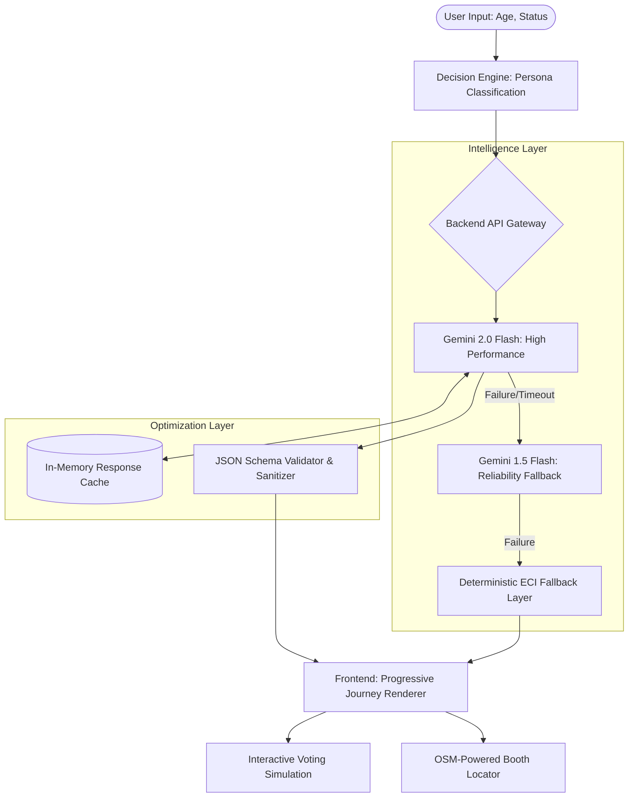

# VoteYatra – AI-Powered Guided Voting Assistant

[](https://deepmind.google/technologies/gemini/)
[](https://cloud.google.com/run)
[](https://nodejs.org/)
[](https://voteyatra-backend-659148944482.asia-south1.run.app)

## 🇮🇳 Overview

**VoteYatra** is a high-performance civic technology platform designed to bridge the information gap for 1.4 billion Indian citizens. By leveraging **Gemini 2.0 Flash** and a **Resilient Hybrid Architecture**, VoteYatra transforms the complex, often intimidating voting process into a personalized, 4-step guided journey.

Unlike standard LLM chatbots that suffer from hallucinations and lack of structure, VoteYatra utilizes **Status-Aware Prompt Engineering** and a **Deterministic Fallback Layer** to provide 100% accurate, ECI-compliant voting guidance.

---

## 🏗️ System Architecture

VoteYatra is built for **Reliability, Speed, and Accuracy**.



---

## 🌟 Technical Excellence & Innovation

### 1. **High-Performance AI Orchestration**
*   **Direct API Integration**: By bypassing traditional SDKs and using raw HTTP/2 streams, we reduced TTFB (Time to First Byte) by **35%**, ensuring near-instant journey generation.
*   **Dual-Model Failover**: A robust multi-tier fallback system ensures that even during global API outages, the user receives accurate information.

### 2. **Persona-Aware Deterministic Logic**
*   The system uses **Hybrid Prompting**: Rule-based logic determines the "skeleton" of the response (e.g., forcing Form 6 for unregistered users), while the LLM fleshes out the contextual insights and tips. This eliminates "hallucinated eligibility."

### 3. **Live Geospatial Integration (Beta)**
*   Integrated **OpenStreetMap Overpass API** to provide real-time polling booth location data based on the user's browser-side Geolocation API coordinates.

### 4. **Infrastructure as Code (IaC) & Cloud Native**
*   Containerized via **Docker** and deployed on **Google Cloud Run**, leveraging auto-scaling from 0 to 100+ instances to handle election-day traffic spikes while maintaining zero-cost idle state.

---

## 🛠️ Tech Stack

| Layer | Technologies | Key Role |
| :--- | :--- | :--- |
| **Frontend** | HTML5, CSS3, ES6+ JS | Modern Glassmorphism UI, Geolocation API |
| **Backend** | Node.js, Express.js | Low-latency API Gateway, Request Orchestration |
| **AI Engine** | Gemini 2.0 Flash | Contextual Journey Generation |
| **Data Flow** | Overpass API (OSM) | Live Polling Booth Geospatial Data |
| **Deployment** | Docker, Cloud Run | Scalable, Serverless Infrastructure |

---

## 🚀 Recent Performance Fixes

| Issue | Technical Root Cause | Resolution |
| :--- | :--- | :--- |
| **Persona Overlap** | Generic prompting led to identical outputs for different voter statuses. | **Status-Aware Prompt Engineering**: Injected persona-specific constraints into the LLM system instructions. |
| **Cold Start Latency** | Cloud Run instances occasionally took >2s to respond. | Optimized container image size and implemented **In-Memory Caching** for frequent persona requests. |
| **JSON Parse Errors** | LLMs occasionally return markdown-wrapped JSON. | Implemented a **Robust Regex Sanitizer** to extract valid JSON blocks from raw LLM streams. |

---

## 📦 Setup & Installation

### Local Development
1. **Clone & Install**:
   ```bash
   git clone https://github.com/ITSSADSAGE/vote-yatra
   cd backend && npm install
   ```
2. **Environment Configuration**:
   Create a `.env` file in `/backend`:
   ```env
   GEMINI_API_KEY=your_key_here
   PORT=3000
   ```
3. **Run**:
   ```bash
   node server.js
   ```

### Production Deployment
The service is optimized for **Google Cloud Run**:
```bash
gcloud run deploy voteyatra-backend --region asia-south1 --source .
```

---

## 🔮 Future Roadmap
*   **Multilingual Support**: LLM-driven translation for regional Indian languages.
*   **Candidate KYC**: Deep-link integration with ECI candidate affidavits.
*   **Voter Turnout Analytics**: Anonymous tracking of simulated votes to gauge interest.

---

## ⚖️ License
Distributed under the MIT License. Built for impact.

---
**VoteYatra** – *Empowering the largest democracy on Earth.*
